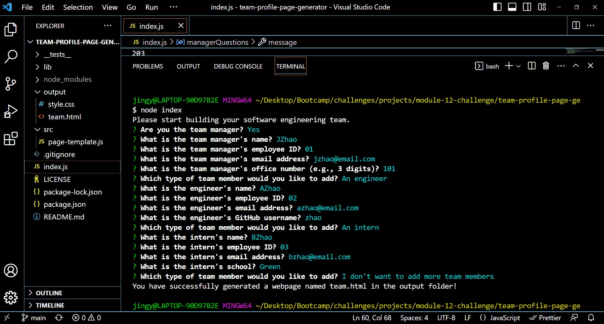
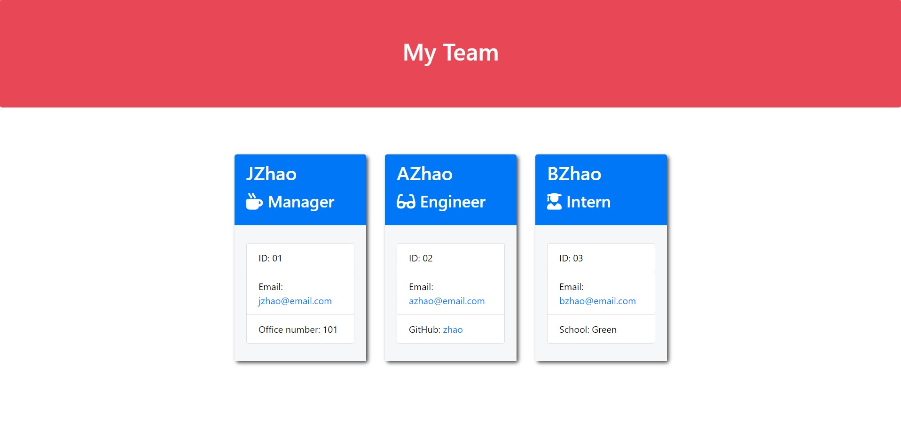

# team-profile-page-generator

## Discription

This is a Node.js command-line application that takes in information about employees on a software engineering team, then generates an HTML webpage that displays summaries for each person.

## Table of Contents

- [Installation](#installation)
- [Usage](#usage)
- [Credits](#credits)
- [License](#license)
- [Contributing](#contributing)
- [Tests](#tests)
- [Questions](#questions)

## Installation

The steps required to install the application:
To install necessary dependencies, run the following command: `npm install`

The application can be accessed on GitHub following [the link to GitHub repository](https://github.com/dr-jingyuezhao/team-profile-page-generator).

## Usage

You can use this applicaiton by running: `node index.js`.

A manager of a software engineering team can generate a webpage that displays the team's basic information containing email addresses, engineer's GitHub profile, and intern's school, etc.

- When starting the application, the user is prompted to enter the team manager's:
    - Name
    - Employee ID
    - Email address
    - Office number

- When a user enters those requirements, the user is presented with a menu with the option to:
    - Add an engineer
    - Add an intern
    - Finish building the team

- When a user selects the engineer option, the user is prompted to enter the following and then taken back to the menu:
    - Engineer's Name
    - ID
    - Email
    - GitHub username

- When a user selects the intern option, the user is prompted to enter the following and then taken back to the menu:
    - Intern’s name
    - ID
    - Email
    - School

- When a user decides to finish building their team, they exit the application and the HTML named team.html is generated in the output folder.

**Application demo**

The following images demonstrate the application's appearance and functionality:

## Credits

The application is written using modified code based on the starter code provided by the class instructor Dan Mueller. The style sheet named style.css in the output folder is also provided by the class instructor Dan Mueller.

Resources:

- https://www.npmjs.com/package/jest
- https://www.npmjs.com/package/inquirer
- https://nodejs.org/docs/latest-v16.x/api/fs.html#
- https://nodejs.org/api/path.html
- https://stackoverflow.com/questions/5266152/how-to-exit-in-node-js
- https://blog.logrocket.com/using-writefilesync-node-js/
- https://pakstech.com/blog/inquirer-js/
- https://nodejs.org/docs/latest-v16.x/api/fs.html#fsexistssyncpath
- https://stackoverflow.com/questions/31645738/-how-to-create-full-path-with-nodes-fs-mkdirsync

## License
This application is licensed under the MIT license.

MIT License

Copyright (c) 2023 Jasmine

Permission is hereby granted, free of charge, to any person obtaining a copy
of this software and associated documentation files (the "Software"), to deal
in the Software without restriction, including without limitation the rights
to use, copy, modify, merge, publish, distribute, sublicense, and/or sell
copies of the Software, and to permit persons to whom the Software is
furnished to do so, subject to the following conditions:

The above copyright notice and this permission notice shall be included in all
copies or substantial portions of the Software.

THE SOFTWARE IS PROVIDED "AS IS", WITHOUT WARRANTY OF ANY KIND, EXPRESS OR
IMPLIED, INCLUDING BUT NOT LIMITED TO THE WARRANTIES OF MERCHANTABILITY,
FITNESS FOR A PARTICULAR PURPOSE AND NONINFRINGEMENT. IN NO EVENT SHALL THE
AUTHORS OR COPYRIGHT HOLDERS BE LIABLE FOR ANY CLAIM, DAMAGES OR OTHER
LIABILITY, WHETHER IN AN ACTION OF CONTRACT, TORT OR OTHERWISE, ARISING FROM,
OUT OF OR IN CONNECTION WITH THE SOFTWARE OR THE USE OR OTHER DEALINGS IN THE
SOFTWARE.

## Contributing
Create a personal fork of the project on Github and make a clean pull request.

## Tests
The application is created using test-driven development and can be tested by running: `npm run test`. 

The tests for all the employee classes are provided for each team member type, which are located in the _tests_ directory and can be accessed on GitHub following [the link to the _tests_ directory in GitHub repository](https://github.com/dr-jingyuezhao/team-profile-page-generator/tree/main/__tests__). 

The application has successfully passed each provided test.

## Questions
If you have any questions about this project, please open an issue or contact me directly at jzhao@outlook.com. 
You can view my profile and find more of my work following [the link to my GitHub profile](https://github.com/dr-jingyuezhao/).

